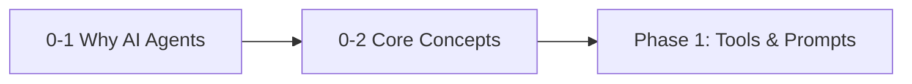

# Phase 0: Foundations & Mindset

!!! info "Phase Overview"
This phase establishes the foundational concepts and mindset needed for AI agent engineering. You'll learn to think like an agent engineer and understand the core principles that differentiate agents from traditional automation.

## Learning Path

## Lessons in This Phase

### [0-1 Why AI Agents?](lesson-1.md)

**Duration:** 45 minutes  
**Prerequisites:** Basic programming knowledge

Learn the evolution from simple automation to intelligent agents and understand why agents represent the future of software automation.

**Key Topics:**

- Evolution of automation
- Agent vs. traditional software
- Real-world agent applications

---

### [0-2 Core Concepts](lesson-2.md)

**Duration:** 60 minutes  
**Prerequisites:** Completion of Lesson 0-1

Deep dive into the fundamental concepts that define AI agents, including autonomy, reasoning, and environmental interaction.

**Key Topics:**

- Agent architecture patterns
- Autonomy vs automation
- Environment interaction models

---

## Phase Completion

!!! success "Ready to Continue?"
After completing both lessons in this phase, you'll be ready to move on to:

    **[Phase 1: Tools, Prompts & Memory →](../phase-1/)**

## Quick Navigation

| Previous                   | Current                  | Next                                    |
| -------------------------- | ------------------------ | --------------------------------------- |
| [Course Home](../index.md) | **Phase 0: Foundations** | [Phase 1: Tools & Prompts](../phase-1/) |
