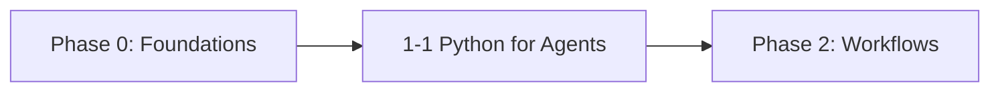

# Phase 1: Tools, Prompts & Memory

!!! info "Phase Overview"
Master the essential building blocks of AI agents: Python integrations, prompt engineering, memory systems, and RAG implementations.

## Learning Path

## Lessons in This Phase

### [1-1 Python for Agents](1-tools-prompts.md)

**Duration:** 2 hours  
**Prerequisites:** Phase 0 completion, Python basics

Learn to integrate Python with AI models, implement effective prompts, work with LangChain, and build memory systems.

**Key Topics:**

- Python AI model integration
- Prompt engineering techniques
- LangChain wrappers
- Vector store memory
- RAG pipeline implementation

---

## Phase Completion

!!! success "Ready to Continue?"
After completing this phase, you'll be ready to move on to:

    **[Phase 2: Agentic Workflows & Reliability →](../phase-2/)**

## Quick Navigation

| Previous                            | Current                      | Next                                      |
| ----------------------------------- | ---------------------------- | ----------------------------------------- |
| [Phase 0: Foundations](../phase-0/) | **Phase 1: Tools & Prompts** | [Phase 2: Agentic Workflows](../phase-2/) |
