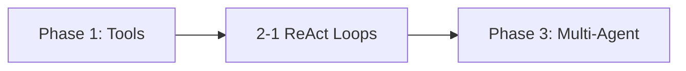

# Phase 2: Agentic Workflows & Reliability

!!! info "Phase Overview"
Build robust, reliable agent systems with ReAct loops, evaluation frameworks, and fault-tolerant workflows.

## Learning Path

## Lessons in This Phase

### [2-1 ReAct Loops & Evaluation](2-agentic-workflows.md)

**Duration:** 3 hours  
**Prerequisites:** Phase 1 completion

Implement robust ReAct loops, hybrid RAG pipelines, and systematic evaluation using LangSmith, PromptLayer, and TruLens.

**Key Topics:**

- ReAct (Reasoning + Acting) patterns
- Hybrid RAG implementation
- Evaluation frameworks
- Error handling & reliability
- Performance monitoring

---

## Phase Completion

!!! success "Ready to Continue?"
After completing this phase, you'll be ready to move on to:

    **[Phase 3: Multi-Agent Orchestration →](../phase-3/)**

## Quick Navigation

| Previous                                | Current                        | Next                                |
| --------------------------------------- | ------------------------------ | ----------------------------------- |
| [Phase 1: Tools & Prompts](../phase-1/) | **Phase 2: Agentic Workflows** | [Phase 3: Multi-Agent](../phase-3/) |
