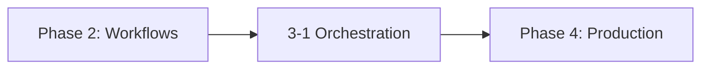

# 🤝 Phase 3: Multi-Agent Orchestration

!!! info "Phase Overview"
    Scale beyond single agents to orchestrated multi-agent systems using LangGraph, AutoGen, and CrewAI.

!!! tip "What You'll Learn"
    - **Multi-agent architecture patterns** for complex workflows
    - **LangGraph** for workflow orchestration and state management
    - **AutoGen** collaborative workflows with multiple agents
    - **CrewAI** task networks and agent coordination
    - **Scalable agent communication** and message passing

---

## 🗺️ Learning Path

---

## 📚 Lessons in This Phase

### [🤖 3-1 Multi-Agent Orchestration](3-multi-agent-orchestration.md)

!!! success "Lesson Details"
    **Duration:** 4 hours  
    **Prerequisites:** Phase 2 completion

    Build collaborative agent systems with planner/executor/reviewer patterns using modern orchestration frameworks.

!!! info "Key Topics"
    - Multi-agent architecture patterns
    - LangGraph for workflow orchestration
    - AutoGen collaborative workflows
    - CrewAI task networks
    - Scalable agent communication

---

## 🎯 Phase Completion

!!! success "Ready to Continue?"
    After completing this phase, you'll be ready to move on to:

    **[Phase 4: Production Deployment & Ops →](../phase-4/)**

!!! tip "Phase 3 Outcomes"
    By the end of this phase, you'll be able to:
    - Design and implement multi-agent systems
    - Use modern orchestration frameworks effectively
    - Coordinate complex workflows across multiple agents
    - Scale agent systems for production use

---

## 🧭 Quick Navigation

!!! info "Course Navigation"
    | Previous                                  | Current                  | Next                               |
    | ----------------------------------------- | ------------------------ | ---------------------------------- |
    | [Phase 2: Agentic Workflows](../phase-2/) | **Phase 3: Multi-Agent** | [Phase 4: Production](../phase-4/) |
