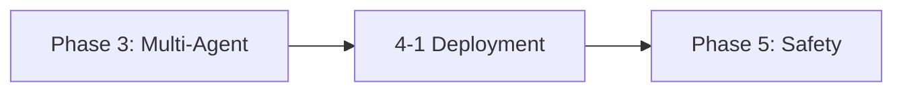

# Phase 4: Production Deployment & Ops

!!! info "Phase Overview"
Deploy agent systems to production with containerization, CI/CD, observability, and operational excellence.

## Learning Path

## Lessons in This Phase

### [4-1 Production Deployment](4-production-deployment.md)

**Duration:** 3 hours  
**Prerequisites:** Phase 3 completion

Learn to containerize, deploy, and operate AI agents in production environments with proper monitoring and incident response.

**Key Topics:**

- Docker containerization
- Serverless deployment strategies
- CI/CD for agent systems
- Observability with Sentry & Prometheus
- Incident response runbooks

---

## Phase Completion

!!! success "Ready to Continue?"
After completing this phase, you'll be ready to move on to:

    **[Phase 5: Advanced Safety, RLHF & Continuous Learning →](../phase-5/)**

## Quick Navigation

| Previous                            | Current                 | Next                                  |
| ----------------------------------- | ----------------------- | ------------------------------------- |
| [Phase 3: Multi-Agent](../phase-3/) | **Phase 4: Production** | [Phase 5: Safety & RLHF](../phase-5/) |
