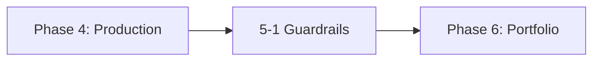

# Phase 5: Advanced Safety, RLHF & Continuous Learning

!!! info "Phase Overview"
Implement advanced safety measures, reinforcement learning from human feedback, and continuous evaluation systems.

## Learning Path

## Lessons in This Phase

### [5-1 Safety & RLHF Systems](5-advanced-safety.md)

**Duration:** 4 hours  
**Prerequisites:** Phase 4 completion

Build multi-layer safety systems with RLHF loops, continuous evaluation, and ethical AI practices.

**Key Topics:**

- Multi-layer safety guardrails
- RLHF implementation
- Continuous evaluation harnesses
- REALM-Bench assessment
- Ethical AI practices

---

## Phase Completion

!!! success "Ready to Continue?"
After completing this phase, you'll be ready to move on to:

    **[Phase 6: Portfolio, Leadership & Foresight →](../phase-6/)**

## Quick Navigation

| Previous                           | Current                    | Next                              |
| ---------------------------------- | -------------------------- | --------------------------------- |
| [Phase 4: Production](../phase-4/) | **Phase 5: Safety & RLHF** | [Phase 6: Portfolio](../phase-6/) |
