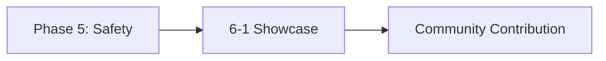

# Phase 6: Portfolio, Leadership & Foresight

!!! info "Phase Overview"
Showcase your work, contribute to the community, develop leadership skills, and establish lifelong learning practices.

## Learning Path

## Lessons in This Phase

### [6-1 Portfolio & Leadership](6-portfolio-leadership.md)

**Duration:** 3 hours  
**Prerequisites:** Phase 5 completion

Create a compelling portfolio, contribute to open-source projects, and develop leadership frameworks for continued growth.

**Key Topics:**

- Portfolio development
- Open-source contributions
- Leadership frameworks
- Professional networking
- Lifelong learning practices

---

## Course Completion

!!! success "Congratulations!"
You've completed the AI Agent Engineer Course! Continue your journey by:

    - Contributing to the [course repository](https://github.com/ai-agent-lab/agent-engineer-course)
    - Joining community discussions
    - Staying updated with latest research

## Quick Navigation

| Previous                              | Current                | Next                       |
| ------------------------------------- | ---------------------- | -------------------------- |
| [Phase 5: Safety & RLHF](../phase-5/) | **Phase 6: Portfolio** | [Course Home](../index.md) |
